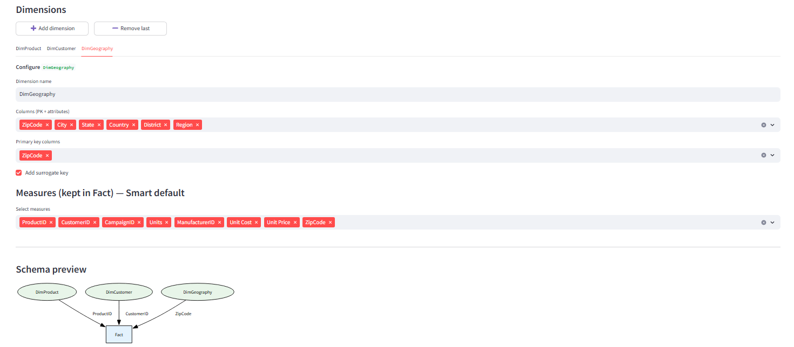
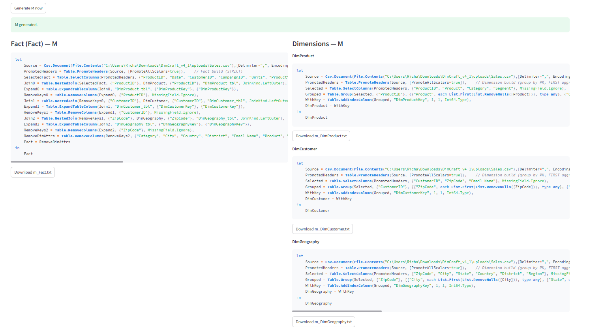
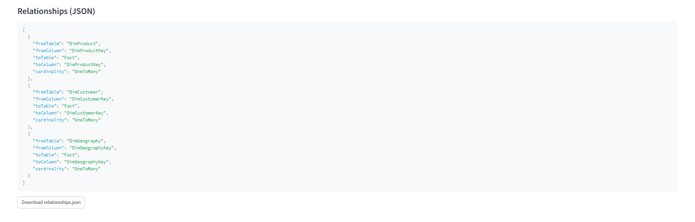

# DimCraft — Automated Star Schema Builder (Power BI / M-Code)

DimCraft automatisiert einen der repetitivsten Schritte im Power-BI-Workflow:

> **Aus einem Flatfile in Sekunden ein sauberes Star Schema erzeugen — inklusive fertigem M-Code für Dimensions und Fact.**

---

## 💡 Problem

Power BI Modellierung folgt fast immer demselben Muster:

1. Dimensionen ableiten  
2. Primary Keys setzen & Surrogate Keys erzeugen  
3. Duplikate bereinigen (FIRST / LAST / DISTINCT)  
4. Fact säubern (Attribute raus, Keys rein)  
5. Measures behalten  
6. Beziehungen korrekt setzen  
7. M-Code anpassen

→ wiederholt, manuell, fehleranfällig  
→ kostet **Zeit**, erzeugt **Risiko**, macht **keinem Spaß**

**DimCraft automatisiert diesen Prozess.**

---

## ⚡ Lösung / Output

DimCraft generiert aus einem Flatfile automatisch:

✅ Dimensionstabellen (mit Surrogate Keys)  
✅ Fact-Tabelle (STRICT: nur Keys + Measures)  
✅ fertigen **Power Query M-Code**  
✅ optional JSON Blueprint (Save/Load)  
✅ Star Schema Preview (Graphviz Diagramm)

**Ziel:** schneller zu einem stabilen Data Model → weniger DAX-Chaos downstream.

---

## ✅ Features (PoC – Version 3.2)

| Kategorie | Status |
|----------|--------|
| Flatfile Upload (CSV/Excel) | ✅ |
| Dimension Builder (PK + Surrogate Key) | ✅ |
| Strict Fact Cleaning (Keys + Measures) | ✅ |
| Star Schema Preview (Graphviz) | ✅ |
| Farbige Flatfile-Vorschau | ✅ |
| Blueprint Save/Load (JSON) | ✅ |
| Automatisches Naming im M-Output (`in <QueryName>`) | ✅ |

---

## 🔜 Roadmap

- automatische Date Dimension
- Aggregationsregeln pro Dimension (FIRST / LAST / MAX / MIN)
- Relationship Export (JSON / M)
- PNG Export der Schema-Ansicht
- Multi-Fact Support
- PBIX Template Export  
- (optional) SaaS-Layer + Publish as Service

---

## ⚙️ Tech-Stack

| Bereich | Technologie |
|--------|-------------|
| Frontend / Logic | Python + Streamlit |
| Data Preview | Pandas |
| Schema Rendering | Graphviz |
| Output | Power Query M |

---

## 🔒 Code Availability

Dieses Repository zeigt:

- Screenshots
- Architektur / Logic Flow
- Output Beispiele (M-Code, JSON)

> **Die Codebasis ist privat (PoC-Stand & laufende Weiterentwicklung).**  
> Fokus liegt hier auf dem Konzept, nicht auf dem Spike-Code.

---
## 📸 Screenshots

**Dimension Builder UI**

**Generated M-Code**

**Star Schema Preview (JSON Relationship + Visual)**

